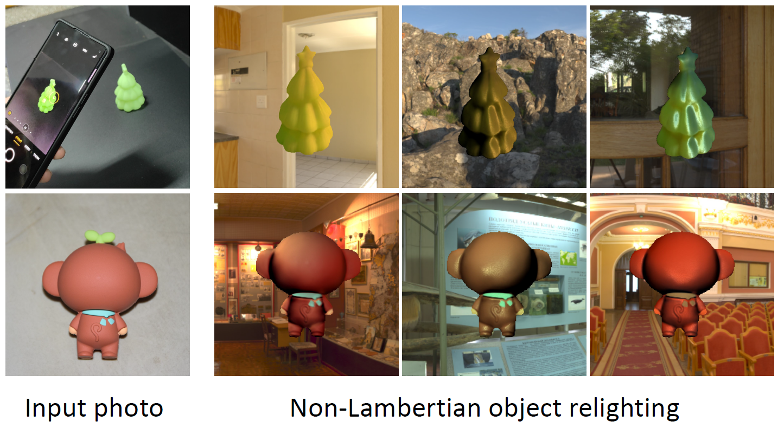

# Weakly-supervised Single-view Image Relighting, CVPR 2023

PyTorch implementation of the paper:

Weakly-supervised single-view image relighting [[arXiv](https://arxiv.org/abs/2303.13852)] [[Project Page](https://renjiaoyi.github.io/relighting/)].

[Renjiao Yi](https://renjiaoyi.github.io/), [[Chenyang Zhu](http://www.zhuchenyang.net/), [Kai Xu](http://kevinkaixu.net/index.html).



## Abstract

We present a learning-based approach to relight a single image of Lambertian and low-frequency specular objects. Our method enables inserting objects from photographs into new scenes and relighting them under the new environment lighting, which is essential for AR applications. To relight the object, we solve both inverse rendering and re-rendering. To resolve the ill-posed inverse rendering, we propose a weakly-supervised method by a low-rank constraint. To facilitate the weakly-supervised training, we contribute Relit, a large-scale (750K images) dataset of videos with aligned objects under changing illuminations. For re-rendering, we propose a differentiable specular rendering layer to render low-frequency non-Lambertian materials under various illuminations of spherical harmonics. The whole pipeline is end-to-end and efficient, allowing for a mobile app implementation of AR object insertion. Extensive evaluations demonstrate that our method achieves state-of-the-art performance. 

## Enviroments
This code has been tested with Ubuntu 18.04, one TeslaT4 GPU with CUDA 11.2, Python 3.7, Pytorch 1.11.0+cu102. 

## Instructions
\InverseRendering includes training and testing scripts of inverse rendering. 

\Relighting includes the relighting scripts after inverse rendering. 

See README in each folder for details. 

## Citation

```bibtex
@InProceedings{Yi_2023_CVPR,
    author    = {Yi, Renjiao and Zhu, Chenyang and Xu, Kai},
    title     = {Weakly-Supervised Single-View Image Relighting},
    booktitle = {Proceedings of the IEEE/CVF Conference on Computer Vision and Pattern Recognition (CVPR)},
    month     = {June},
    year      = {2023},
    pages     = {8402-8411}
}
```

